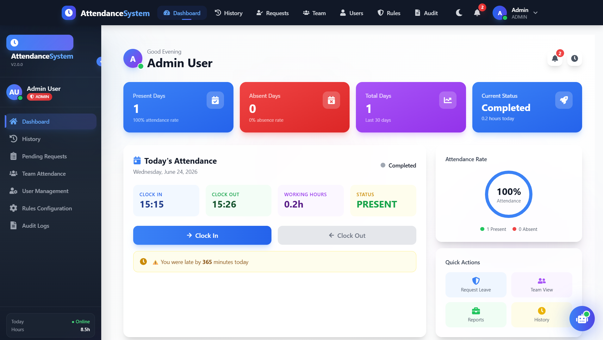
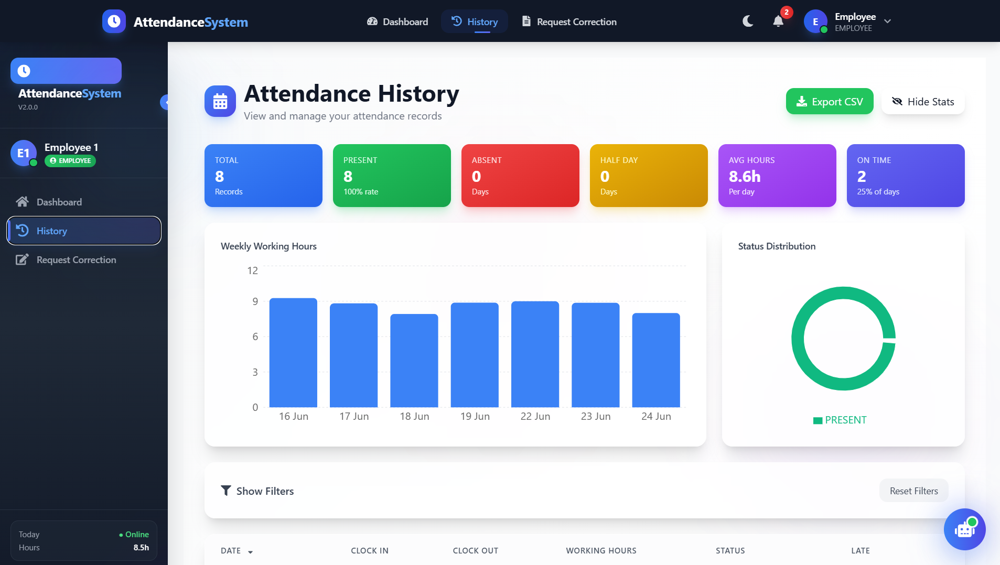
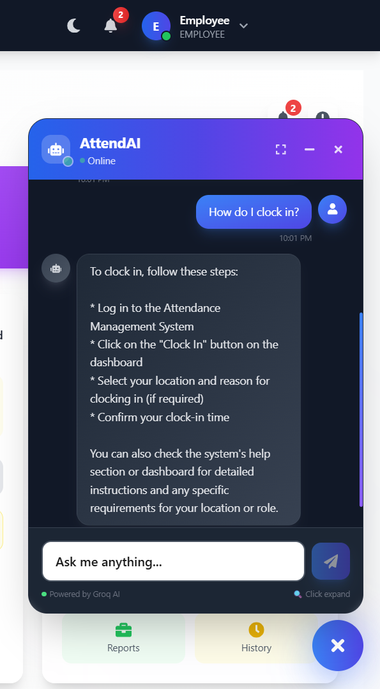
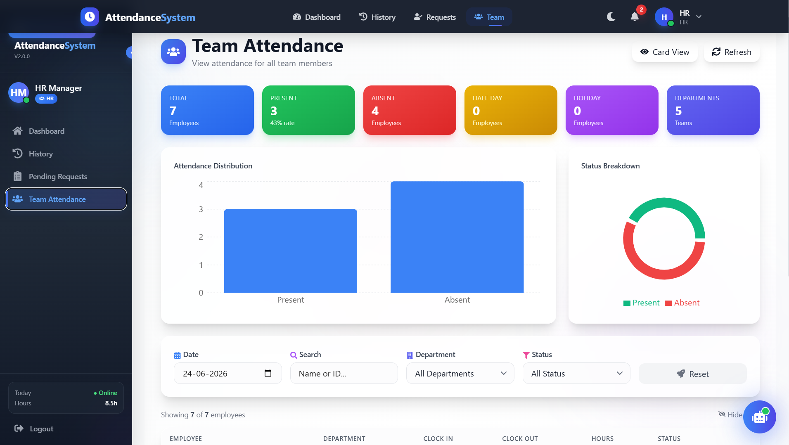
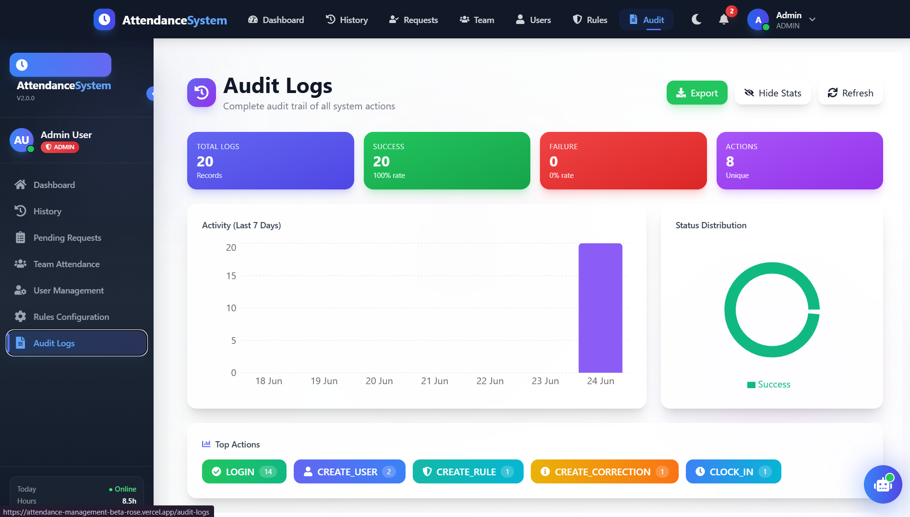

# 🚀 Attendance Management System

<div align="center">


**A comprehensive, production-ready attendance management system with AI-powered chatbot assistance**

[](https://attendance-management-beta-rose.vercel.app)
[](#documentation)
[](https://github.com/Aditya7015/attendance_management/issues)
[](https://github.com/Aditya7015/attendance_management/issues)

</div>

---

## 📋 Table of Contents

- [📋 Table of Contents](#-table-of-contents)
- [✨ Features](#-features)
- [🎯 Problem Solved](#-problem-solved)
- [🛠️ Tech Stack](#️-tech-stack)
- [📊 Architecture Overview](#-architecture-overview)
- [🚀 Live Demo](#-live-demo)
- [📸 Screenshots](#-screenshots)
- [⚡ Quick Start](#-quick-start)
- [📖 API Documentation](#-api-documentation)
- [👥 Role-Based Access](#-role-based-access)
- [🤖 AI Chatbot Assistant](#-ai-chatbot-assistant)
- [📊 Database Design](#-database-design)
- [🔐 Security Features](#-security-features)
- [📈 Future Roadmap](#-future-roadmap)
- [🤝 Contributing](#-contributing)
- [📄 License](#-license)

---

## ✨ Features

### Core Features

#### 👤 **User Management**
- Role-based access (Admin, HR, Employee)
- User creation, update, deactivation
- Employee ID generation
- Role assignment and management

#### ⏰ **Attendance Tracking**
- Clock in/out with timestamps
- Today's attendance status
- Working hours calculation
- Overtime tracking
- Late arrival detection

#### 📝 **Correction Requests**
- Submit correction requests
- Request status tracking
- Approve/Reject workflow
- Review comments

#### 📊 **History & Reports**
- Comprehensive attendance history
- Date range filtering
- Export to CSV
- Visual analytics dashboard

#### 🔐 **Audit Logs**
- Complete audit trail
- Action filtering
- Date range search
- Export capabilities

#### 🤖 **AI Chatbot Assistant**
- Powered by Groq AI
- Attendance-related queries
- 24/7 availability
- Contextual responses

### Additional Features

- 🔔 **Real-time Notifications**
- 📱 **Responsive Design** - Works on all devices
- 🌓 **Dark Mode Support**
- 📊 **Advanced Analytics** - Charts and statistics
- 🔒 **Secure Authentication** - JWT-based
- 📋 **Export Reports** - CSV format
- 💡 **Quick Actions** - Role-based shortcuts

---

## 🎯 Problem Solved

Traditional attendance management systems often suffer from:

❌ **Manual tracking** - Time-consuming and error-prone  
❌ **Paper-based records** - Difficult to search and maintain  
❌ **No real-time visibility** - Managers can't see attendance instantly  
❌ **Complex correction process** - Cumbersome approval workflows  
❌ **Lack of audit trails** - No accountability for changes  

**Our Solution** provides:

✅ **Automated tracking** - One-click clock in/out  
✅ **Digital records** - Searchable, filterable history  
✅ **Real-time dashboard** - Instant visibility  
✅ **Streamlined corrections** - Simple request and review process  
✅ **Complete audit trail** - Every action logged  

---

## 🛠️ Tech Stack

### Frontend

| Technology | Purpose | Icon |
|------------|---------|------|
| **React 18** | UI Library with Hooks & Context | ⚛️ |
| **Tailwind CSS** | Utility-first CSS framework | 🎨 |
| **Framer Motion** | Production-ready animations | 🎬 |
| **Recharts** | Charting library | 📊 |

### Backend

| Technology | Purpose | Icon |
|------------|---------|------|
| **Node.js 18** | JavaScript runtime | 🟢 |
| **Express.js** | Web framework | ⚡ |
| **MongoDB Atlas** | Cloud database | 🍃 |
| **JWT** | Authentication | 🔑 |

### AI & DevOps

| Technology | Purpose | Icon |
|------------|---------|------|
| **Groq AI** | Chatbot intelligence | 🤖 |
| **Docker** | Containerization | 🐳 |
| **Vercel** | Frontend hosting | ▲ |
| **Render** | Backend hosting | 🚀 |

---

## 📊 Architecture Overview
|─────────────────────────────────────────────────────────────┐
│ Frontend (React) │
│ ┌────────────┐ ┌────────────┐ ┌────────────────────┐ │
│ │ Login │ │ Dashboard │ │ Attendance Pages │ │
│ └────────────┘ └────────────┘ └────────────────────┘ │
│ ┌────────────┐ ┌────────────┐ ┌────────────────────┐ │
│ │ Chatbot │ │ History │ │ Team Management │ │
│ └────────────┘ └────────────┘ └────────────────────┘ │
└─────────────────────────────────────────────────────────────┘
│
▼
┌─────────────────────────────────────────────────────────────┐
│ Backend (Node.js) │
│ ┌─────────────────────────────────────────────────────┐ │
│ │ API Gateway │ │
│ ├──────────┬──────────┬──────────┬───────────────────┤ │
│ │ Auth │Attendence│Correction│ User Routes │ │
│ │ Routes │ Routes │ Routes │ │ │
│ ├──────────┴──────────┴──────────┴───────────────────┤ │
│ │ Controllers │ │
│ ├─────────────────────────────────────────────────────┤ │
│ │ Middleware │ │
│ └─────────────────────────────────────────────────────┘ │
└─────────────────────────────────────────────────────────────┘
│
▼
┌─────────────────────────────────────────────────────────────┐
│ Database (MongoDB) │
│ ┌────────────┐ ┌────────────┐ ┌────────────────────┐ │
│ │ Users │ │Attendance │ │ CorrectionRequests │ │
│ └────────────┘ └────────────┘ └────────────────────┘ │
│ ┌────────────┐ ┌────────────┐ ┌────────────────────┐ │
│ │ AuditLogs │ │ Rules │ │ │ │
│ └────────────┘ └────────────┘ └────────────────────┘ │
└─────────────────────────────────────────────────────────────┘
│
▼
┌─────────────────────────────────────────────────────────────┐
│ AI Service │
│ ┌─────────────────────────────────────────────────────┐ │
│ │ Groq AI │ │
│ │ (llama-3.1-8b-instant) │ │
│ └─────────────────────────────────────────────────────┘ │
└─────────────────────────────────────────────────────────────┘


---

## 🚀 Live Demo

### 🌐 **Visit:** [Attendance Management System](https://attendance-management-beta-rose.vercel.app)

### 🎮 **Test Credentials**

| Role | Email | Password |
|------|-------|----------|
| 👑 **Admin** | `admin@company.com` | `Admin@123` |
| 👔 **HR** | `hr@company.com` | `Hr@123` |
| 👤 **Employee 1** | `employee1@company.com` | `Emp@123` |
| 👤 **Employee 2** | `employee2@company.com` | `Emp@123` |
| 👤 **Employee 3** | `employee3@company.com` | `Emp@123` |

> 💡 **Pro Tip:** Click on the role buttons on the login page to auto-fill credentials!

---

## 📸 Screenshots

### 🏠 Dashboard


### 📊 Attendance History
 (screenshots/history2.png)

### 🤖 AI Chatbot


### 👥 Team Management


### 🔐 Audit Logs


> 

---

## ⚡ Quick Start

### Prerequisites
- Node.js 18+
- MongoDB Atlas account (or local MongoDB)
- npm or yarn

### 1️⃣ Clone the Repository

```bash
git clone https://github.com/Aditya7015/attendance_management.git
cd attendance_management


2️⃣ Backend Setup
bash
cd backend
npm install
cp .env.example .env
# Edit .env with your MongoDB URI and JWT secret
npm run seed  # Seed the database with sample data
npm run dev   # Start development server
3️⃣ Frontend Setup
bash
cd frontend
npm install
cp .env.example .env
# Edit .env with your backend API URL
npm start     # Start development server
4️⃣ Access the Application

Frontend: http://localhost:3000

Backend API: http://localhost:5000

🐳 Docker Setup (Alternative)
bash
docker-compose up -d --build
docker exec -it attendance-backend npm run seed
📖 API Documentation
🔑 Authentication
Method	Endpoint	Description	Access
POST	/api/auth/login	Login user	Public
GET	/api/auth/me	Get current user	Private
POST	/api/auth/logout	Logout user	Private
⏰ Attendance
Method	Endpoint	Description	Access
POST	/api/attendance/clock-in	Clock in	Employee
POST	/api/attendance/clock-out	Clock out	Employee
GET	/api/attendance/today-status	Today's status	All
GET	/api/attendance/history	History	All
📝 Corrections
Method	Endpoint	Description	Access
POST	/api/corrections/request	Request correction	Employee
GET	/api/corrections	Get requests	HR/Admin
PUT	/api/corrections/:id/review	Review request	HR/Admin
👥 User Management
Method	Endpoint	Description	Access
GET	/api/users	Get all users	Admin
POST	/api/users	Create user	Admin
PUT	/api/users/:id	Update user	Admin
⚙️ Rules
Method	Endpoint	Description	Access
GET	/api/rules	Get rules	All
POST	/api/rules	Create rule	Admin
PUT	/api/rules/:id	Update rule	Admin
📊 Audit Logs
Method	Endpoint	Description	Access
GET	/api/audit-logs	Get audit logs	Admin
🤖 AI Chatbot
Method	Endpoint	Description	Access
POST	/api/chat	Send message	All
👥 Role-Based Access
👑 Admin
Full System Access

✅ User management

✅ Role management

✅ Rule configuration

✅ Audit logs view

✅ All HR permissions

👔 HR
Team Management

✅ View all attendance

✅ Review correction requests

✅ Team attendance view

✅ User view access

👤 Employee
Personal Management

✅ Clock in/out

✅ View own history

✅ Request corrections

✅ View own corrections

🤖 AI Chatbot Assistant
Features
24/7 Availability - Always ready to help

Attendance Support - Get answers about attendance

System Guidance - Learn how to use features

Quick Answers - Instant responses to common queries

How to Use
Click the 🤖 robot icon in the bottom-right corner

Type your question

Get instant AI-powered responses

Sample Questions
"How do I clock in?"

"How to request a correction?"

"What are the attendance rules?"

"How to view my attendance history?"

Powered By
Groq AI - Fast and efficient AI model

llama-3.1-8b-instant - Optimized for quick responses

📊 Database Design
Collections Structure
Users Collection
json
{
  "_id": "ObjectId",
  "email": "string (unique)",
  "passwordHash": "string",
  "fullName": "string",
  "role": "enum ['employee', 'hr', 'admin']",
  "employeeId": "string (unique)",
  "department": "string",
  "designation": "string",
  "phoneNumber": "string",
  "isActive": "boolean",
  "lastLogin": "Date",
  "createdAt": "Date",
  "updatedAt": "Date"
}
Attendance Records Collection
json
{
  "_id": "ObjectId",
  "userId": "ObjectId (ref: User)",
  "date": "string (YYYY-MM-DD)",
  "clockIn": {
    "time": "Date",
    "source": "enum ['web', 'mobile', 'api']",
    "ip": "string",
    "location": {
      "type": "enum [null, 'Point']",
      "coordinates": "[number]"
    }
  },
  "clockOut": {
    "time": "Date",
    "source": "enum ['web', 'mobile', 'api']",
    "ip": "string",
    "location": {
      "type": "enum [null, 'Point']",
      "coordinates": "[number]"
    }
  },
  "status": "enum ['present', 'absent', 'half_day', 'holiday', 'weekend']",
  "workingHours": "number",
  "overtimeMinutes": "number",
  "isLate": "boolean",
  "lateMinutes": "number",
  "isEarlyLeave": "boolean",
  "earlyLeaveMinutes": "number",
  "note": "string",
  "createdAt": "Date",
  "updatedAt": "Date"
}
Correction Requests Collection
json
{
  "_id": "ObjectId",
  "userId": "ObjectId (ref: User)",
  "attendanceRecordId": "ObjectId (ref: Attendance)",
  "requestedDate": "string (YYYY-MM-DD)",
  "requestedClockIn": "string (HH:MM)",
  "requestedClockOut": "string (HH:MM)",
  "reason": "string",
  "status": "enum ['pending', 'approved', 'rejected']",
  "reviewedBy": "ObjectId (ref: User)",
  "reviewComment": "string",
  "reviewedAt": "Date",
  "createdAt": "Date",
  "updatedAt": "Date"
}
Attendance Rules Collection
json
{
  "_id": "ObjectId",
  "ruleKey": "string (unique)",
  "ruleName": "string",
  "ruleValue": "mixed",
  "dataType": "enum ['string', 'number', 'boolean', 'time', 'array']",
  "category": "enum ['time', 'leave', 'overtime', 'general']",
  "description": "string",
  "effectiveFrom": "Date",
  "effectiveTo": "Date",
  "createdBy": "ObjectId (ref: User)",
  "updatedBy": "ObjectId (ref: User)",
  "isActive": "boolean",
  "priority": "number",
  "createdAt": "Date",
  "updatedAt": "Date"
}
Audit Logs Collection
json
{
  "_id": "ObjectId",
  "userId": "ObjectId (ref: User)",
  "userEmail": "string",
  "userRole": "enum ['employee', 'hr', 'admin']",
  "action": "enum ['LOGIN', 'LOGOUT', 'CLOCK_IN', 'CLOCK_OUT', 'CREATE_CORRECTION', 'APPROVE_CORRECTION', 'REJECT_CORRECTION', 'CREATE_USER', 'UPDATE_USER', 'DELETE_USER', 'UPDATE_ROLE', 'CREATE_RULE', 'UPDATE_RULE', 'DELETE_RULE', 'VIEW_AUDIT_LOGS', 'CHAT']",
  "resource": "enum ['auth', 'attendance', 'correction', 'user', 'rule', 'audit', 'chat']",
  "resourceId": "ObjectId",
  "details": "mixed",
  "ip": "string",
  "userAgent": "string",
  "status": "enum ['success', 'failure']",
  "errorMessage": "string",
  "timestamp": "Date"
}
Relationships Diagram

┌─────────────┐     ┌──────────────────┐     ┌─────────────────────┐
│    Users    │────▶│  Attendance      │────▶│  CorrectionRequests │
│             │     │                  │     │                     │
│ - _id       │     │ - _id            │     │ - _id               │
│ - email     │     │ - userId         │     │ - userId            │
│ - password  │     │ - date           │     │ - requestedDate     │
│ - fullName  │     │ - clockIn        │     │ - status            │
│ - role      │     │ - clockOut       │     └─────────────────────┘
│ - isActive  │     │ - workingHours   │
└─────────────┘     │ - status         │
       │            └──────────────────┘
       │                    │
       │                    │
       ▼                    ▼
┌─────────────┐     ┌──────────────────┐
│  AuditLogs  │     │   Rules          │
│             │     │                  │
│ - _id       │     │ - _id            │
│ - userId    │     │ - ruleKey        │
│ - action    │     │ - ruleName       │
│ - resource  │     │ - ruleValue      │
│ - details   │     │ - isActive       │
│ - timestamp │     └──────────────────┘
└─────────────┘


🔐 Security Features
Authentication & Authorization
JWT Authentication - Secure token-based auth

Role-Based Access - Granular permissions

Password Hashing - Bcrypt encryption

Session Management - Token expiration

Data Protection
Input Validation - Express-validator

CORS Protection - Controlled origins

Helmet.js - Security headers

Rate Limiting - Prevent abuse

Audit & Compliance
Complete Audit Trail - All actions logged

IP Tracking - Request source tracking

User Agent Logging - Browser/device tracking

Error Logging - Detailed error capture

📈 Future Roadmap
Phase 1: Enhancements
Email notifications for approvals

Mobile responsive PWA

Advanced reporting dashboard

Export to PDF/Excel

Phase 2: Features
Leave management integration

Shift management

Biometric integration

Geolocation check-in

Phase 3: AI & Automation
Smart attendance predictions

Automatic shift scheduling

Voice commands

Advanced chatbot capabilities

🤝 Contributing
We welcome contributions! Here's how you can help:

🍴 Fork the repository

🌿 Create a feature branch: git checkout -b feature/AmazingFeature

💻 Commit your changes: git commit -m 'Add some AmazingFeature'

📤 Push to the branch: git push origin feature/AmazingFeature

🔄 Open a Pull Request

Development Guidelines
Follow ESLint rules

Write meaningful commit messages

Add tests for new features

Update documentation

📄 License
This project is licensed under the MIT License - see the LICENSE file for details.

🙏 Acknowledgments
React - Amazing UI library

Node.js - Powerful runtime

MongoDB - Flexible database

Groq - AI capabilities

All Contributors - Making this project awesome

📞 Contact & Support
Links
🌐 Live Demo: attendance-management-beta-rose.vercel.app

🐙 GitHub: github.com/Aditya7015/attendance_management

📡 Backend API: attendance-management-1dmo.onrender.com

Support
For support, email 📧 adityatiwari7553@gmail.com or create an issue on GitHub.

<div align="center">
⭐ If you found this project useful, please give it a star! ⭐

Made with ❤️ by Aditya Tiwari

</div> ```
